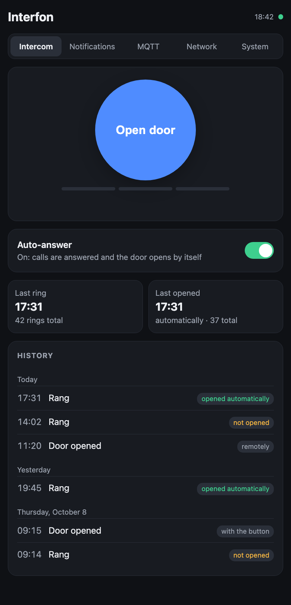
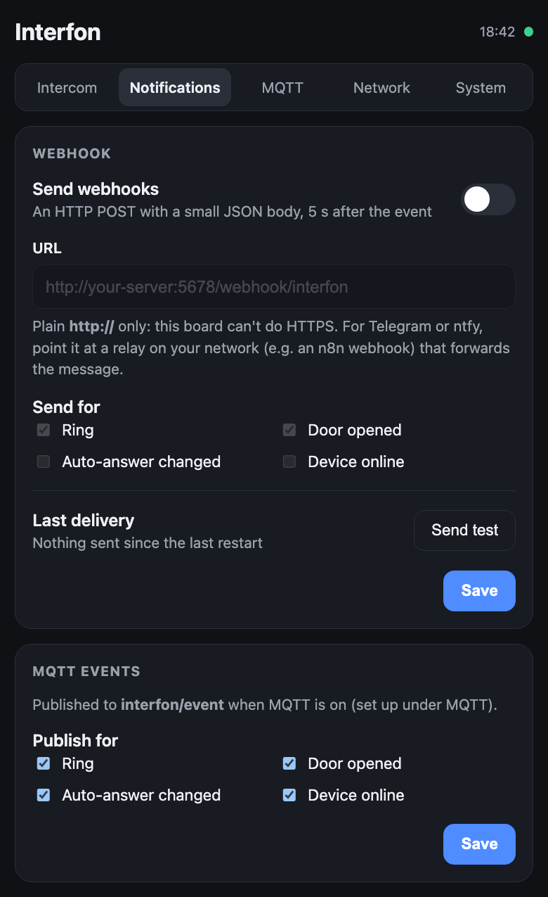
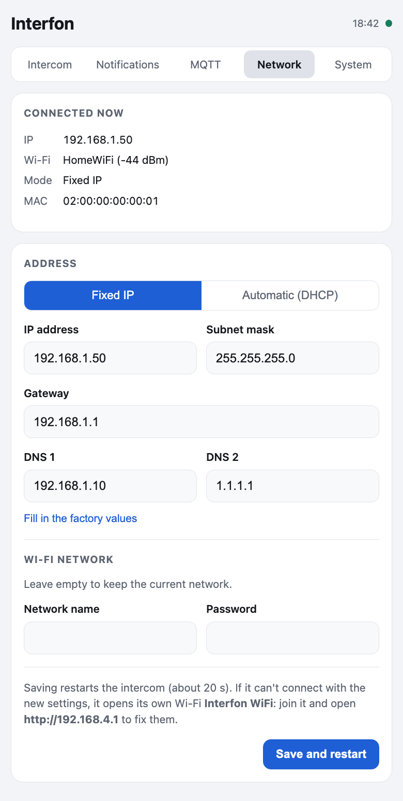

# interfon-iot

**Open-source firmware for a Genway apartment intercom**, running on the Wemos D1 mini
(ESP8266) that sits on the handset's relay board. It knows when someone rings, can answer and
open the building door by itself or when you tap a button, keeps a history, and connects to
Home Assistant, Homey, MQTT and webhooks.

Everything runs locally: no cloud account, no phone app. You configure it from a page served by
the device itself.

<table>
  <tr>
    <td></td>
    <td></td>
    <td></td>
  </tr>
  <tr>
    <td align="center"><sub>Intercom</sub></td>
    <td align="center"><sub>Notifications</sub></td>
    <td align="center"><sub>Network</sub></td>
  </tr>
</table>

## Features

- **Knows when someone rings**, and ignores repeat buzzes within 10 seconds.
- **Opens the door the way a person would**: picks up the handset, presses the door button for
  2 seconds, hangs up. (The building only releases the door during a live call.)
- **Three ways to open**: automatically on every ring (auto-answer), from the page, Home Assistant
  or Homey, or with a physical push button.
- **History** of the last 10 events plus running counts. Survives restarts and power cuts.
- **Built-in admin page**: no app, no cloud, works without internet.
- **Settings you change on the page, not in the firmware**: network, MQTT and notifications.
  Nothing about where notifications go is compiled in.
- **Home Assistant and Homey** through ESPHome's encrypted native API, plus optional MQTT with
  Home Assistant discovery.
- **Recoverable**: if it can't join your Wi-Fi, it opens its own hotspot so you can fix it
  from a phone.

## Hardware

| Part | Notes |
|---|---|
| Genway intercom handset + its relay add-on board | Two relays driven by a ULN2003 |
| Wemos D1 mini (ESP8266, 4 MB flash, CH340 USB) | Plugs into the relay board |
| 12 V supply | Feeds the relay board; a buck converter on it powers the D1 mini. USB isn't needed in use |

### Pins

| D1 mini | GPIO | Connected to | Behaviour |
|---|---|---|---|
| D7 | 13 | Call detect from the board | Idle HIGH, pulled LOW during a call |
| D5 | 14 | ULN2003 → relay K1 (with 180 Ω across the line) | Lifts the handset (off-hook) |
| D6 | 12 | ULN2003 → relay K2 | Presses the handset's door button |
| D2 | 4 | Optional push button to GND | Opens the door locally |
| D4 | 2 | On-board LED (active low) | Status |

Check the wiring on your own board with a multimeter before flashing; revisions may differ.

## How it works

```
 call ──► D7 goes LOW ──► debounce 100 ms ──► log "ring" ──► notify (webhook / MQTT)
                                                   │
                                     auto-answer on? ──► door sequence
                                                            │
      K1 on (pick up) ─ 1 s ─ K2 on (door) ─ 2 s ─ K2 off ─ 1 s ─ K1 off (hang up)
```

Opening from the page, Home Assistant, Homey or the button runs the same sequence. A second
trigger while the sequence is running is ignored.

## Getting started

You need [ESPHome](https://esphome.io) 2026.9 or newer, or Docker.

**1. Configure.**

```sh
cd esphome
cp secrets.example.yaml secrets.yaml    # Wi-Fi, API key, web login
cp site.example.yaml site.yaml          # fixed IP, gateway, DNS
```

Pick a fixed IP **outside your router's DHCP pool**, so the router can never hand the same
address to another device. Generate the API key with `openssl rand -base64 32`.

**2. First flash, over USB.**

```sh
esphome run interfon.yaml --device /dev/cu.usbserial-XXXX
```

If you flash with esptool instead, pass `--flash-size 4MB`. With the wrong size the ESP8266 SDK
can't find its saved Wi-Fi credentials.

**3. Later updates, over Wi-Fi.**

```sh
esphome run interfon.yaml --device <device-ip>
```

<details>
<summary>Building with Docker</summary>

```sh
docker run --rm -v "$PWD":/config -v esphome-cache:/cache \
  ghcr.io/esphome/esphome:2026.9.0 run interfon.yaml --device <device-ip>
```

Keep the PlatformIO cache in a named volume (`esphome-cache`). On macOS a bind-mounted cache
breaks the toolchain unpack.
</details>

**4. Open `http://<device-ip>/`** and log in with the `web_username` / `web_password` from
`secrets.yaml`.

## Using it

### The admin page

| Section | What's there |
|---|---|
| **Intercom** | Open door (two taps, so a stray touch can't open it), live progress that follows the real relays, auto-answer switch, last ring / last opened, history grouped by day |
| **Notifications** | Webhook URL and which events to send (ring, door opened, auto-answer changed, device online), the last delivery result, a test button; which events to publish over MQTT |
| **MQTT** | On/off, broker, port, username, password, topic prefix, Home Assistant discovery, connection state, test publish |
| **Network** | What it's connected to; fixed IP or DHCP, mask, gateway, two DNS servers; change Wi-Fi network |
| **System** | Firmware, uptime, free memory, settings storage state, test ring, restart, link to the standard ESPHome page |

Passwords you enter (MQTT, Wi-Fi) can be replaced but are never shown again.

### Home Assistant

Discovered automatically: **Settings → Devices & services → ESPHome**, then enter the API key.
If you'd rather use MQTT, turn on MQTT and discovery on the admin page.

### Homey

Install the community **ESPHome** app and add the device by IP with the API key. *Ring* is
declared as a motion sensor on purpose: that is what makes Homey offer a "ringing" trigger
card. Homey fixes capabilities at pairing time, so re-add the device after changing entities.

### Notifications

Webhooks are an HTTP POST with a JSON body, sent 5 seconds after the event so a slow server can
never hold up the door:

```json
{"device":"interfon","event":"ring","detail":"","time":"2026-10-12T17:31:05","uptime":1234}
```

| `event` | `detail` |
|---|---|
| `ring` | |
| `door_opened` | `auto`, `remote` or `button` |
| `auto_answer` | `on` or `off` |
| `online` | sent once after boot |
| `test` | from the test button |

MQTT events carry the same JSON on `<prefix>/event`, and every entity's state is published under
`<prefix>/…` as usual for ESPHome.

**Telegram, ntfy, Pushover…** The ESP8266 doesn't have the memory for HTTPS, so webhooks must be
plain `http://`. Point the webhook at something on your network (an n8n or Node-RED flow, for
example) and let it forward the message.

### HTTP API

Everything sits behind the web login (HTTP digest auth).

| Route | |
|---|---|
| `GET /admin/settings` | current settings; passwords are never returned (`mqtt_pass_set: true`) |
| `POST /admin/settings` | form fields; only the fields sent change. Validated as a whole: nothing is saved if any field is wrong |
| `GET /admin/info` | IP, Wi-Fi, signal, uptime, free memory, MQTT state, last webhook result |
| `POST /admin/test?what=webhook\|mqtt` | send a test notification |
| `POST /admin/reboot` | restart |
| `POST /button/Open%20door/press` | open the door (ESPHome REST, by entity **name**) |
| `POST /switch/Auto-answer/toggle` | toggle auto-answer |
| `GET /events` | live state stream (server-sent events) |

## Troubleshooting

**Can't reach it after changing network settings.** It falls back to its own Wi-Fi hotspot
(`Interfon WiFi`). Join it, open `http://192.168.4.1`, and fix the settings on the Network page.

**Wi-Fi flashing isn't possible.** Flash over USB:
`esptool --port <port> --baud 115200 write-flash --flash-size 4MB --flash-mode dout 0x0 firmware.bin`.
Only 115200 baud works reliably on this board's CH340.

**The relays click but the door doesn't open.** That's expected without a call. The building
only releases the door while the handset is connected to a live call, which is also why
*Simulate ring* on the System page is safe to press.

**Settings show "last save FAILED".** The flash write didn't verify. The previous settings are
still intact. Try again, and if it keeps failing, the flash chip may be wearing out.

## Design notes

- **Settings storage.** Runtime settings live in two dedicated 4 KB flash sectors at 2 MB,
  outside ESPHome's preferences. That area is only 512 bytes on the ESP8266, and it's
  positional: adding a record there would shift and wipe the stored history. The two sectors
  alternate. Each save goes to the older copy and is read back to verify, and the newest valid
  copy wins at boot, so a power cut during a save can't lose your settings.
- **Fixed IP that sticks.** ESPHome rebuilds its Wi-Fi entry from saved credentials without the
  manual IP. The component re-applies the fixed IP right after Wi-Fi setup, before the first
  connection.
- **Nothing blocking inside web requests.** On the ESP8266, web requests run in a context where
  flash writes and blocking network calls aren't allowed. Requests are checked and answered
  there; saving and applying happen in the main loop.
- **The door comes first.** Webhooks are queued and sent after the door sequence, never in
  front of it. MQTT publishes immediately, since it doesn't block.

## Security

- The page and API use HTTP digest auth over plain HTTP. Keep the device on a trusted network
  and don't expose it to the internet.
- `secrets.yaml`, `site.yaml`, build output and compiled firmware are git-ignored. Compiled
  firmware contains your credentials.
- **Never publish a flash dump.** Any ESP8266 dump contains the Wi-Fi password in plain text.

## Project layout

```
esphome/
  interfon.yaml                  device config: entities, door sequence, history
  interfon-ui.js                 the admin page (embedded with web_server.js_include)
  common/network.yaml            Wi-Fi block: fixed IP, two DNS servers, fallback hotspot
  components/interfon_admin/     runtime settings + /admin API (C++)
  secrets.example.yaml           → secrets.yaml
  site.example.yaml              → site.yaml
docs/                            screenshots
serial_monitor.py                read the board's serial output
```

## License

**Noncommercial use only.** Licensed under the
[PolyForm Noncommercial License 1.0.0](LICENSE): use, modify and share it for any
noncommercial purpose. Commercial use needs permission.

Required Notice: Copyright (c) 2026 donkfather (https://github.com/donkfather/interfon-iot)

The C++ files in [`esphome/components/interfon_admin/`](esphome/components/interfon_admin) build
on ESPHome's GPLv3 runtime, so they are [GPL-3.0](esphome/components/interfon_admin/LICENSE).
